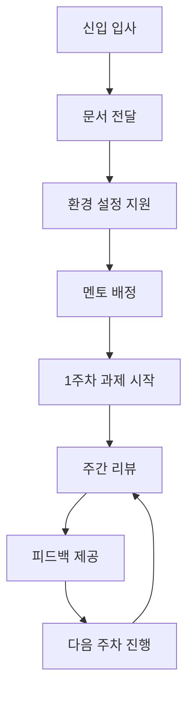

# 📚 DSFlow 프로젝트 문서화

이 디렉토리에는 DSFlow 프로젝트의 완전한 문서화 자료가 포함되어 있습니다.

## 📋 문서 목록

### 1. `DSFlow_프로젝트_가이드.md`
**신입 개발자를 위한 완전한 프로젝트 가이드**
- 📊 프로젝트 개요 및 목표
- 🔧 기술 스택 상세 설명
- 🏗️ 아키텍처 및 코드 구조
- 🚀 환경 설정 및 실행 방법
- 💻 백엔드/프론트엔드 개발 과정
- 🐛 문제 해결 과정 및 노하우
- 📏 코딩 컨벤션 및 베스트 프랙티스

### 2. `신입개발자_과제.md`
**6주간의 체계적인 온보딩 프로그램**
- 📅 주차별 상세 과제 및 목표
- 🎯 단계별 학습 로드맵
- 📊 평가 기준 및 방법
- 💡 학습 리소스 및 지원 방법
- 🚀 커리어 발전 가이드

## 🔄 PDF 변환 방법

### Option 1: Pandoc 사용 (권장)

```bash
# Pandoc 설치 (macOS)
brew install pandoc

# Pandoc 설치 (Ubuntu)
sudo apt-get install pandoc

# PDF 변환
pandoc DSFlow_프로젝트_가이드.md -o DSFlow_프로젝트_가이드.pdf --pdf-engine=xelatex -V mainfont="Noto Sans CJK KR"

pandoc 신입개발자_과제.md -o 신입개발자_과제.pdf --pdf-engine=xelatex -V mainfont="Noto Sans CJK KR"
```

### Option 2: VS Code 확장 사용

1. **Markdown PDF 확장 설치**
   - VS Code에서 `Markdown PDF` 확장 설치
   - 마크다운 파일 열기
   - `Ctrl+Shift+P` → "Markdown PDF: Export (pdf)" 선택

### Option 3: 온라인 변환 도구

1. **GitLab/GitHub Pages 이용**
   - 마크다운 파일을 GitLab에 업로드
   - GitLab의 PDF 변환 기능 이용

2. **온라인 변환 사이트**
   - [Markdown to PDF](https://md-to-pdf.fly.dev/)
   - [HackMD](https://hackmd.io/)

## 📝 문서 작성 가이드라인

### 마크다운 스타일 가이드

```markdown
# 제목 1 (프로젝트/섹션 제목)
## 제목 2 (주요 카테고리)
### 제목 3 (하위 항목)

**굵은 글씨**: 중요한 개념이나 키워드
*기울임 글씨*: 강조하고 싶은 내용

`코드`: 파일명, 클래스명, 메소드명
```java
// 코드 블록
public class Example {
    // 주석
}
```

> 인용구: 중요한 정보나 주의사항

- 일반 리스트
- 항목들

1. 순서가 있는 리스트
2. 단계별 설명

| 테이블 | 헤더 |
|--------|------|
| 내용   | 데이터 |

[링크 텍스트](URL)

```

### 이모지 사용 가이드

```markdown
📋 목차, 리스트
🎯 목표, 핵심 포인트  
🔧 도구, 설정
🚀 시작, 실행
💻 코딩, 개발
🐛 문제, 에러
✅ 완료, 성공
❌ 실패, 주의
💡 팁, 아이디어
📚 학습, 자료
⚛️ React 관련
☕ Java 관련
🐳 Docker 관련
📊 데이터, 통계
🔍 분석, 검토
```

## 🎨 PDF 스타일링 옵션

### Pandoc 고급 옵션

```bash
# 한글 폰트와 스타일링이 적용된 PDF 생성
pandoc DSFlow_프로젝트_가이드.md \
  -o DSFlow_프로젝트_가이드.pdf \
  --pdf-engine=xelatex \
  -V mainfont="Noto Sans CJK KR" \
  -V sansfont="Noto Sans CJK KR" \
  -V monofont="D2Coding" \
  -V geometry:margin=2cm \
  -V fontsize=11pt \
  -V linestretch=1.2 \
  --toc \
  --toc-depth=3 \
  --highlight-style=github
```

### 커스텀 CSS (VS Code Markdown PDF)

```css
/* .vscode/markdown-pdf.css */
body {
    font-family: "Noto Sans CJK KR", Arial, sans-serif;
    line-height: 1.6;
    color: #333;
}

h1, h2, h3 {
    color: #2c3e50;
    border-bottom: 2px solid #3498db;
    padding-bottom: 0.3em;
}

code {
    background-color: #f8f9fa;
    padding: 0.2em 0.4em;
    border-radius: 3px;
    font-family: "D2Coding", "Consolas", monospace;
}

pre {
    background-color: #f8f9fa;
    padding: 1em;
    border-radius: 5px;
    overflow-x: auto;
}

blockquote {
    border-left: 4px solid #3498db;
    padding-left: 1em;
    margin-left: 0;
    font-style: italic;
    color: #555;
}

table {
    border-collapse: collapse;
    width: 100%;
    margin: 1em 0;
}

th, td {
    border: 1px solid #ddd;
    padding: 0.5em;
    text-align: left;
}

th {
    background-color: #f2f2f2;
    font-weight: bold;
}
```

## 📖 사용 시나리오

### 신입 개발자 온보딩

1. **1일차**: `DSFlow_프로젝트_가이드.md` 전체 읽기
2. **2일차**: 환경 설정 및 프로젝트 실행
3. **3일차**: `신입개발자_과제.md` 1주차 과제 시작
4. **주간 리뷰**: 진도 점검 및 질의응답

### 기술 면접 자료

1. **프로젝트 소개**: 가이드 문서의 "프로젝트 개요" 섹션
2. **기술적 도전**: "개발 과정과 문제 해결" 섹션
3. **코드 품질**: "코드 컨벤션" 섹션
4. **학습 능력**: 과제 문서의 학습 과정

### 팀 온보딩 프로세스



## 🔄 문서 유지보수

### 정기 업데이트 일정

- **월 1회**: 기술 스택 업데이트 반영
- **분기 1회**: 과제 내용 및 평가 기준 검토
- **반기 1회**: 전체 문서 구조 개선

### 피드백 수집 방법

1. **신입 개발자 설문**: 과제 완료 후 피드백 수집
2. **멘토 의견**: 지도 과정에서의 개선 사항
3. **HR 피드백**: 채용 및 온보딩 관점에서의 의견

### 버전 관리

```
v1.0.0 - 초기 문서 작성 (2024-06)
v1.1.0 - 신입 과제 추가 (2024-06)  
v1.2.0 - PDF 스타일링 개선 (예정)
```

## 📞 문의 및 기여

### 문서 개선 제안

- **GitHub Issue**: 오타, 내용 오류 신고
- **Pull Request**: 직접 수정 제안
- **Slack**: #documentation 채널에서 토론

### 기여자

- **주 작성자**: Claude (AI Assistant)
- **기술 검토**: 시니어 개발팀
- **내용 검증**: HR팀

---

*이 문서들은 DSFlow 프로젝트의 지식을 체계적으로 전달하고, 신입 개발자의 성공적인 온보딩을 위해 작성되었습니다.* 