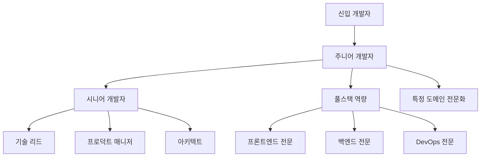

# 🚀 DSFlow 신입 개발자 온보딩 과제

## 📋 과제 개요

이 과제는 **6주간**의 체계적인 학습 프로그램으로, DSFlow 프로젝트를 통해 실무 개발 역량을 기르는 것이 목표입니다.

### 🎯 학습 목표
- 풀스택 웹 개발 역량 습득
- 실무 코딩 컨벤션 및 협업 방식 이해
- 문제 해결 능력 및 자기주도 학습 능력 배양
- 프로덕션 레벨 코드 작성 경험

---

## 📅 주차별 상세 과제

### 🔧 1주차: 환경 설정 및 기초 학습

#### Day 1-2: 개발 환경 구축
**목표**: 로컬 개발 환경을 성공적으로 구축

**과제**:
1. **필수 도구 설치**
   ```bash
   # 체크리스트
   □ Java 17 JDK 설치 및 JAVA_HOME 설정
   □ Node.js 18+ 설치
   □ Docker & Docker Compose 설치
   □ Git 설치 및 계정 설정
   □ IDE 설치 (IntelliJ IDEA 또는 VSCode)
   ```

2. **프로젝트 실행**
   ```bash
   # 실행 단계
   git clone <repository-url>
   cd DSFlow
   cp docker/env.example docker/.env
   cd docker
   docker-compose -f docker-compose.dev.yml up -d
   ```

3. **실행 확인**
   - [ ] 프론트엔드 접속: http://localhost:3000
   - [ ] 백엔드 API 확인: http://localhost:8080/api/jobs
   - [ ] 데이터베이스 연결 확인

**제출물**: 실행 스크린샷과 설치 과정에서 겪은 문제 및 해결 방법

#### Day 3-5: 기술 스택 기초 학습

**Spring Boot 학습 (2일)**:
1. **기본 개념 이해**
   - IoC/DI 컨테이너
   - 어노테이션 기반 설정
   - Spring MVC 패턴

2. **실습 과제**
   ```java
   // 간단한 REST API 만들기
   @RestController
   @RequestMapping("/hello")
   public class HelloController {
       
       @GetMapping("/{name}")
       public ResponseEntity<String> sayHello(@PathVariable String name) {
           // TODO: "Hello, {name}!" 메시지 반환
       }
   }
   ```

**React 학습 (1일)**:
1. **컴포넌트 기초**
   - 함수형 컴포넌트
   - useState, useEffect 훅
   - Props와 State

2. **실습 과제**
   ```typescript
   // 카운터 컴포넌트 만들기
   const Counter: React.FC = () => {
       // TODO: 증가/감소 버튼이 있는 카운터 구현
   };
   ```

**제출물**: 실습 코드와 학습 정리 노트

### 📖 2주차: 코드 분석 및 이해

#### Day 1-3: 전체 코드 리뷰
**목표**: DSFlow 프로젝트의 전체 구조와 동작 방식 이해

**과제**:
1. **백엔드 코드 분석**
   ```java
   // 각 클래스의 역할과 관계를 분석하고 주석 추가
   
   // JobDefinitionController.java
   /* 
    * TODO: 이 클래스의 역할은?
    * TODO: 어떤 엔드포인트들을 제공하는가?
    * TODO: 어떤 서비스를 사용하는가?
    */
   
   // JobDefinitionService.java
   /*
    * TODO: 핵심 비즈니스 로직은?
    * TODO: 어떤 검증을 수행하는가?
    * TODO: 데이터베이스와 어떻게 상호작용하는가?
    */
   ```

2. **프론트엔드 코드 분석**
   ```typescript
   // 각 컴포넌트의 역할과 데이터 흐름 분석
   
   // JobForm.tsx
   /*
    * TODO: 이 컴포넌트의 주요 기능은?
    * TODO: 어떤 state를 관리하는가?
    * TODO: API와 어떻게 통신하는가?
    */
   ```

**제출물**: 코드 분석 보고서 (마크다운 형식)

#### Day 4-5: API 테스트 및 데이터 흐름 파악

**과제**:
1. **Postman으로 모든 API 테스트**
   ```bash
   # 테스트할 API 목록
   POST /api/jobs      # Job 생성
   GET  /api/jobs      # Job 목록 조회  
   GET  /api/jobs/{id} # Job 상세 조회
   PUT  /api/jobs/{id} # Job 수정
   DELETE /api/jobs/{id} # Job 삭제
   ```

2. **데이터 흐름 다이어그램 작성**
   - 사용자 요청부터 데이터베이스까지의 전체 흐름
   - 각 계층별 역할과 책임
   - 에러 처리 흐름

**제출물**: 
- Postman 테스트 결과 (스크린샷)
- 데이터 흐름 다이어그램
- 발견된 개선점 목록

### 🛠️ 3주차: 새로운 기능 개발

#### 과제: Job 실행 통계 기능 구현

**요구사항**:
사용자가 Job들의 실행 통계를 볼 수 있는 기능을 개발해주세요.

#### 백엔드 개발 (Day 1-3)

**1. 통계 DTO 생성**
```java
// JobStatisticsDto.java
public class JobStatisticsDto {
    private String jobCode;
    private String jobName;
    private long totalExecutions;     // 총 실행 횟수
    private long successfulExecutions; // 성공 실행 횟수
    private long failedExecutions;    // 실패 실행 횟수
    private double successRate;       // 성공률 (%)
    private LocalDateTime lastExecutionTime; // 마지막 실행 시간
    
    // TODO: 생성자, getter, setter 추가
}
```

**2. Repository 메소드 추가**
```java
// JobExecutionLogRepository.java에 추가
public interface JobExecutionLogRepository extends JpaRepository<JobExecutionLog, Long> {
    
    // TODO: 특정 Job의 통계 데이터를 조회하는 메소드 구현
    @Query("SELECT new com.datasolution.dsflow.dto.JobStatisticsDto(" +
           "j.jobCode, j.jobName, " +
           "COUNT(log), " +
           "SUM(CASE WHEN log.status = 'SUCCESS' THEN 1 ELSE 0 END), " +
           "SUM(CASE WHEN log.status = 'FAILED' THEN 1 ELSE 0 END), " +
           "MAX(log.endTime)) " +
           "FROM JobExecutionLog log " +
           "JOIN JobDefinition j ON log.jobCode = j.jobCode " +
           "GROUP BY j.jobCode, j.jobName")
    List<JobStatisticsDto> findJobStatistics();
    
    // TODO: 기간별 필터링을 지원하는 메소드도 추가
    List<JobExecutionLog> findByJobCodeAndStartTimeBetween(
        String jobCode, LocalDateTime start, LocalDateTime end);
}
```

**3. Service 클래스 생성**
```java
// JobStatisticsService.java
@Service
@Transactional(readOnly = true)
public class JobStatisticsService {
    
    private final JobExecutionLogRepository logRepository;
    
    public JobStatisticsService(JobExecutionLogRepository logRepository) {
        this.logRepository = logRepository;
    }
    
    // TODO: 전체 Job 통계 조회
    public List<JobStatisticsDto> getAllJobStatistics() {
        // 구현해주세요
    }
    
    // TODO: 특정 기간의 통계 조회
    public List<JobStatisticsDto> getJobStatisticsByPeriod(
        LocalDateTime start, LocalDateTime end) {
        // 구현해주세요
    }
    
    // TODO: 성공률 계산 로직
    private double calculateSuccessRate(long total, long success) {
        // 구현해주세요
    }
}
```

**4. Controller 생성**
```java
// JobStatisticsController.java
@RestController
@RequestMapping("/api/statistics")
public class JobStatisticsController {
    
    private final JobStatisticsService statisticsService;
    
    // TODO: 전체 통계 조회 엔드포인트
    @GetMapping("/jobs")
    public ResponseEntity<List<JobStatisticsDto>> getJobStatistics() {
        // 구현해주세요
    }
    
    // TODO: 기간별 통계 조회 엔드포인트  
    @GetMapping("/jobs/period")
    public ResponseEntity<List<JobStatisticsDto>> getJobStatisticsByPeriod(
        @RequestParam @DateTimeFormat(iso = DateTimeFormat.ISO.DATE_TIME) LocalDateTime start,
        @RequestParam @DateTimeFormat(iso = DateTimeFormat.ISO.DATE_TIME) LocalDateTime end) {
        // 구현해주세요
    }
}
```

#### 프론트엔드 개발 (Day 4-5)

**1. API 클라이언트 추가**
```typescript
// api.ts에 추가
export interface JobStatisticsDto {
  jobCode: string;
  jobName: string;
  totalExecutions: number;
  successfulExecutions: number;
  failedExecutions: number;
  successRate: number;
  lastExecutionTime: string;
}

// TODO: 통계 조회 API 함수 구현
export const getJobStatistics = async (): Promise<JobStatisticsDto[]> => {
  // 구현해주세요
};

export const getJobStatisticsByPeriod = async (
  start: string, 
  end: string
): Promise<JobStatisticsDto[]> => {
  // 구현해주세요
};
```

**2. 통계 페이지 컴포넌트 생성**
```typescript
// src/pages/Statistics.tsx
import React, { useState, useEffect } from 'react';
import { Table, DatePicker, Card, Statistic, Row, Col } from 'antd';
import { getJobStatistics, JobStatisticsDto } from '../api';

const Statistics: React.FC = () => {
  const [statistics, setStatistics] = useState<JobStatisticsDto[]>([]);
  const [loading, setLoading] = useState(false);
  
  // TODO: 컴포넌트 마운트 시 데이터 로드
  useEffect(() => {
    // 구현해주세요
  }, []);
  
  // TODO: 기간 필터 핸들러
  const handleDateRangeChange = (dates: any) => {
    // 구현해주세요
  };
  
  // TODO: 테이블 컬럼 정의
  const columns = [
    {
      title: 'Job 코드',
      dataIndex: 'jobCode',
      key: 'jobCode',
    },
    {
      title: 'Job 이름', 
      dataIndex: 'jobName',
      key: 'jobName',
    },
    {
      title: '총 실행 횟수',
      dataIndex: 'totalExecutions', 
      key: 'totalExecutions',
    },
    {
      title: '성공률',
      dataIndex: 'successRate',
      key: 'successRate',
      render: (rate: number) => `${rate.toFixed(1)}%`,
    },
    // TODO: 나머지 컬럼들 추가
  ];
  
  return (
    <div>
      <h2>Job 실행 통계</h2>
      
      {/* TODO: 요약 통계 카드들 */}
      <Row gutter={16} style={{ marginBottom: 16 }}>
        <Col span={6}>
          <Card>
            <Statistic title="전체 Job 수" value={statistics.length} />
          </Card>
        </Col>
        {/* TODO: 더 많은 요약 통계 추가 */}
      </Row>
      
      {/* TODO: 기간 선택 필터 */}
      <DatePicker.RangePicker 
        onChange={handleDateRangeChange}
        style={{ marginBottom: 16 }}
      />
      
      {/* TODO: 통계 테이블 */}
      <Table 
        columns={columns}
        dataSource={statistics}
        loading={loading}
        rowKey="jobCode"
      />
    </div>
  );
};

export default Statistics;
```

**3. 라우팅 추가**
```typescript
// App.tsx에 추가
import Statistics from './pages/Statistics';

// TODO: 라우터에 통계 페이지 경로 추가
```

**4. 네비게이션 메뉴 추가**
```typescript
// components/layout/AppSider.tsx에 추가
// TODO: 사이드바에 "통계" 메뉴 아이템 추가
```

#### 테스트 및 검증 (Day 6-7)

**과제**:
1. **단위 테스트 작성**
   ```java
   // JobStatisticsServiceTest.java
   @SpringBootTest
   class JobStatisticsServiceTest {
       
       @Test
       void 전체_Job_통계_조회_테스트() {
           // TODO: 테스트 데이터 준비
           // TODO: 서비스 메소드 호출
           // TODO: 결과 검증
       }
   }
   ```

2. **통합 테스트**
   ```java
   // JobStatisticsControllerTest.java
   @WebMvcTest(JobStatisticsController.class)
   class JobStatisticsControllerTest {
       
       @Test
       void 통계_API_호출_테스트() throws Exception {
           // TODO: MockMvc를 사용한 API 테스트
       }
   }
   ```

3. **프론트엔드 테스트**
   ```typescript
   // Statistics.test.tsx
   import { render, screen } from '@testing-library/react';
   import Statistics from './Statistics';
   
   test('통계 페이지가 정상적으로 렌더링된다', () => {
     // TODO: 컴포넌트 렌더링 테스트
   });
   ```

**제출물**:
- 구현된 전체 소스 코드
- API 테스트 결과 (Postman)
- 프론트엔드 실행 스크린샷
- 테스트 코드 및 실행 결과

### 📊 4주차: 고급 기능 및 최적화

#### 과제: 실시간 Job 모니터링 기능

**목표**: Job 실행 상태를 실시간으로 모니터링할 수 있는 기능 구현

#### 백엔드: WebSocket 구현 (Day 1-3)

**1. WebSocket 설정**
```java
// WebSocketConfig.java
@Configuration
@EnableWebSocket
public class WebSocketConfig implements WebSocketConfigurer {
    
    @Override
    public void registerWebSocketHandlers(WebSocketHandlerRegistry registry) {
        // TODO: WebSocket 핸들러 등록
    }
}

// JobMonitoringWebSocketHandler.java
@Component
public class JobMonitoringWebSocketHandler extends TextWebSocketHandler {
    
    private final Set<WebSocketSession> sessions = new ConcurrentHashMap<>();
    
    @Override
    public void afterConnectionEstablished(WebSocketSession session) {
        // TODO: 세션 관리
    }
    
    // TODO: Job 상태 변경 시 클라이언트에 알림
    public void notifyJobStatusChange(JobExecutionLog log) {
        // 구현해주세요
    }
}
```

**2. Job 실행 이벤트 발행**
```java
// JobExecutionEventPublisher.java
@Component
public class JobExecutionEventPublisher {
    
    private final ApplicationEventPublisher eventPublisher;
    
    // TODO: Job 시작/완료/실패 이벤트 발행
    public void publishJobStarted(String jobCode) {
        // 구현해주세요
    }
    
    public void publishJobCompleted(JobExecutionLog log) {
        // 구현해주세요
    }
}
```

#### 프론트엔드: 실시간 업데이트 (Day 4-5)

**1. WebSocket 클라이언트**
```typescript
// websocket.ts
export class JobMonitoringWebSocket {
  private socket: WebSocket | null = null;
  private listeners: ((data: any) => void)[] = [];
  
  connect() {
    // TODO: WebSocket 연결
  }
  
  disconnect() {
    // TODO: 연결 해제  
  }
  
  onMessage(callback: (data: any) => void) {
    // TODO: 메시지 리스너 등록
  }
}
```

**2. 실시간 모니터링 컴포넌트**
```typescript
// src/pages/Monitoring.tsx
const Monitoring: React.FC = () => {
  const [runningJobs, setRunningJobs] = useState<JobExecutionLog[]>([]);
  const [wsConnected, setWsConnected] = useState(false);
  
  useEffect(() => {
    // TODO: WebSocket 연결 및 실시간 데이터 수신
  }, []);
  
  return (
    <div>
      {/* TODO: 실시간 상태 표시 */}
      {/* TODO: 실행 중인 Job 목록 */}
      {/* TODO: 실시간 로그 스트림 */}
    </div>
  );
};
```

#### 성능 최적화 (Day 6-7)

**과제**:
1. **데이터베이스 쿼리 최적화**
   - 인덱스 추가
   - N+1 문제 해결
   - 쿼리 성능 분석

2. **프론트엔드 최적화**
   - React.memo 사용
   - 불필요한 리렌더링 방지
   - 번들 사이즈 최적화

**제출물**:
- 성능 최적화 보고서
- 최적화 전후 성능 비교 데이터

### 🧪 5주차: 테스트 및 문서화

#### Day 1-3: 테스트 코드 작성

**목표**: 95% 이상의 테스트 커버리지 달성

**1. 백엔드 테스트**
```java
// 유닛 테스트
@ExtendWith(MockitoExtension.class)
class JobDefinitionServiceTest {
    
    @Mock
    private JobDefinitionRepository repository;
    
    @InjectMocks  
    private JobDefinitionService service;
    
    @Test
    void Job_생성_성공_테스트() {
        // TODO: Mocking과 검증
    }
    
    @Test
    void 중복_Job코드_예외_테스트() {
        // TODO: 예외 상황 테스트
    }
}

// 통합 테스트
@SpringBootTest
@TestContainers
class JobDefinitionIntegrationTest {
    
    @Container
    static PostgreSQLContainer<?> postgres = new PostgreSQLContainer<>("postgres:15");
    
    @Test
    void Job_전체_라이프사이클_테스트() {
        // TODO: 실제 DB를 사용한 통합 테스트
    }
}
```

**2. 프론트엔드 테스트**
```typescript
// JobForm.test.tsx
import { render, screen, fireEvent, waitFor } from '@testing-library/react';
import { vi } from 'vitest';

describe('JobForm', () => {
  test('폼 제출이 올바르게 동작한다', async () => {
    // TODO: 폼 입력 및 제출 테스트
  });
  
  test('유효성 검사가 올바르게 동작한다', () => {
    // TODO: 입력값 검증 테스트
  });
});
```

**3. E2E 테스트**
```typescript
// cypress/e2e/job-management.cy.ts
describe('Job 관리', () => {
  it('Job을 생성하고 목록에서 확인할 수 있다', () => {
    // TODO: 전체 사용자 플로우 테스트
  });
});
```

#### Day 4-5: 문서화

**1. API 문서 자동 생성**
```java
// Swagger 설정
@Configuration
@EnableSwagger2
public class SwaggerConfig {
    
    @Bean
    public Docket api() {
        return new Docket(DocumentationType.SWAGGER_2)
                .select()
                .apis(RequestHandlerSelectors.basePackage("com.datasolution.dsflow.controller"))
                .build()
                .apiInfo(apiInfo());
    }
}
```

**2. 사용자 매뉴얼 작성**
```markdown
# DSFlow 사용자 매뉴얼

## Job 등록하기
1. 상단 메뉴에서 "Job 등록" 클릭
2. 필수 정보 입력
   - Job 코드: 영문 대문자, 숫자, 언더스코어만 사용
   - Job 이름: 사용자가 이해하기 쉬운 이름
   - ...

## 스케줄 설정하기
...
```

**제출물**:
- 테스트 커버리지 리포트
- API 문서 (Swagger)
- 사용자 매뉴얼
- 개발자 가이드

### 🚀 6주차: 배포 및 운영

#### Day 1-3: CI/CD 파이프라인 구축

**1. GitHub Actions 워크플로우**
```yaml
# .github/workflows/ci-cd.yml
name: CI/CD Pipeline

on:
  push:
    branches: [ main, develop ]
  pull_request:
    branches: [ main ]

jobs:
  test:
    runs-on: ubuntu-latest
    steps:
      - uses: actions/checkout@v3
      
      # TODO: 백엔드 테스트
      - name: Backend Tests
        run: |
          cd backend
          ./mvnw test
      
      # TODO: 프론트엔드 테스트  
      - name: Frontend Tests
        run: |
          cd frontend
          npm test
          
  build-and-deploy:
    needs: test
    runs-on: ubuntu-latest
    if: github.ref == 'refs/heads/main'
    steps:
      # TODO: Docker 이미지 빌드 및 배포
```

**2. 환경별 설정 분리**
```yaml
# application-dev.yml
spring:
  datasource:
    url: jdbc:h2:mem:testdb
    
# application-prod.yml  
spring:
  datasource:
    url: jdbc:postgresql://prod-db:5432/dsflow
```

#### Day 4-5: 모니터링 및 로깅

**1. 로그 개선**
```java
// 구조화된 로깅
@Service
public class JobDefinitionService {
    
    private static final Logger logger = LoggerFactory.getLogger(JobDefinitionService.class);
    
    public JobDefinitionDto createJob(JobDefinitionDto dto) {
        logger.info("Job 생성 시작 - jobCode: {}", dto.getJobCode());
        
        try {
            // 비즈니스 로직
            logger.info("Job 생성 완료 - jobCode: {}, id: {}", dto.getJobCode(), result.getId());
            return result;
        } catch (Exception e) {
            logger.error("Job 생성 실패 - jobCode: {}, error: {}", dto.getJobCode(), e.getMessage(), e);
            throw e;
        }
    }
}
```

**2. 애플리케이션 메트릭스**
```java
// Micrometer를 사용한 커스텀 메트릭
@Component
public class JobMetrics {
    
    private final Counter jobCreationCounter;
    private final Timer jobExecutionTimer;
    
    public JobMetrics(MeterRegistry meterRegistry) {
        this.jobCreationCounter = Counter.builder("jobs.created")
                .description("Number of jobs created")
                .register(meterRegistry);
                
        this.jobExecutionTimer = Timer.builder("jobs.execution.time")
                .description("Job execution time")
                .register(meterRegistry);
    }
}
```

#### Day 6-7: 프로덕션 배포

**과제**:
1. **운영 환경 구성**
   - Docker Compose 운영 설정
   - 환경 변수 관리
   - 데이터베이스 마이그레이션

2. **모니터링 대시보드**
   - Grafana 대시보드 구성
   - 알림 설정
   - 로그 중앙화

**제출물**:
- CI/CD 파이프라인 구성 파일
- 모니터링 대시보드 스크린샷
- 운영 가이드 문서

---

## 📊 평가 기준 및 방법

### 🎯 평가 항목별 세부 기준

#### 1. 코드 품질 (40점)

**우수 (36-40점)**:
- [ ] 모든 코딩 컨벤션을 일관되게 준수
- [ ] Clean Code 원칙을 적극적으로 적용
- [ ] 적절한 디자인 패턴 사용
- [ ] 포괄적인 에러 처리 구현
- [ ] 코드 중복 최소화

**양호 (28-35점)**:
- [ ] 대부분의 코딩 컨벤션 준수
- [ ] 기본적인 Clean Code 원칙 적용
- [ ] 필수 에러 처리 구현
- [ ] 일부 코드 중복 존재

**보통 (20-27점)**:
- [ ] 기본적인 코딩 컨벤션 준수
- [ ] 최소한의 에러 처리
- [ ] 코드 중복이 다소 존재

**미흡 (19점 이하)**:
- [ ] 코딩 컨벤션 미준수
- [ ] 에러 처리 부족
- [ ] 코드 품질 전반적으로 낮음

#### 2. 기능 구현 (30점)

**우수 (27-30점)**:
- [ ] 모든 요구사항 100% 구현
- [ ] 추가적인 개선사항 제안 및 구현
- [ ] 뛰어난 사용자 경험 제공
- [ ] 성능 최적화 적용

**양호 (21-26점)**:
- [ ] 핵심 요구사항 90% 이상 구현
- [ ] 기본적인 사용자 경험 제공
- [ ] 일부 성능 고려사항 적용

**보통 (15-20점)**:
- [ ] 기본 요구사항 70% 이상 구현
- [ ] 최소한의 기능 동작

**미흡 (14점 이하)**:
- [ ] 요구사항 미충족
- [ ] 기능이 정상 동작하지 않음

#### 3. 테스트 및 문서화 (20점)

**우수 (18-20점)**:
- [ ] 90% 이상 테스트 커버리지
- [ ] 완성도 높은 문서화
- [ ] API 문서 자동화
- [ ] 사용자 매뉴얼 제공

**양호 (14-17점)**:
- [ ] 70% 이상 테스트 커버리지
- [ ] 기본적인 문서화 완료
- [ ] API 문서 제공

**보통 (10-13점)**:
- [ ] 50% 이상 테스트 커버리지
- [ ] 최소한의 문서화

**미흡 (9점 이하)**:
- [ ] 테스트 코드 부족
- [ ] 문서화 미흡

#### 4. 협업 및 소통 (10점)

**우수 (9-10점)**:
- [ ] Git 사용 숙련도 높음 (의미있는 커밋 메시지, 브랜치 전략)
- [ ] 적극적인 코드 리뷰 참여
- [ ] 효과적인 질문과 문제 해결
- [ ] 팀 프로세스 개선 제안

**양호 (7-8점)**:
- [ ] 기본적인 Git 사용
- [ ] 코드 리뷰 참여
- [ ] 적절한 질문과 소통

**보통 (5-6점)**:
- [ ] Git 기본 사용 가능
- [ ] 최소한의 소통

**미흡 (4점 이하)**:
- [ ] Git 사용 미숙
- [ ] 소통 부족

### 📈 주차별 중간 평가

**1-2주차 평가 (20점)**:
- 환경 설정 완료 (5점)
- 기술 스택 이해도 (10점)  
- 코드 분석 보고서 품질 (5점)

**3-4주차 평가 (40점)**:
- 기능 구현 완성도 (25점)
- 코드 품질 (10점)
- 테스트 코드 (5점)

**5-6주차 평가 (40점)**:
- 고급 기능 구현 (15점)
- 테스트 커버리지 (10점)
- 문서화 (10점)
- 배포 및 운영 (5점)

### 🏆 최종 등급 기준

- **A 등급 (90-100점)**: 뛰어난 개발자, 즉시 실무 투입 가능
- **B 등급 (80-89점)**: 우수한 개발자, 짧은 추가 교육 후 실무 투입
- **C 등급 (70-79점)**: 보통 수준, 추가 교육 및 멘토링 필요
- **D 등급 (60-69점)**: 기초 부족, 체계적인 재교육 필요
- **F 등급 (60점 미만)**: 불합격, 다른 직무 고려 권장

---

## 💡 학습 지원 및 리소스

### 📚 필수 학습 자료

#### 온라인 강의
1. **Spring Boot**
   - "스프링 부트 개념과 활용" - 백기선
   - "스프링 부트와 JPA 활용" - 김영한

2. **React**
   - React 공식 튜토리얼
   - "Modern React with Redux" - Stephen Grider

3. **Database**
   - "SQL 첫걸음" - 아사이 아츠시
   - JPA/Hibernate 기초

#### 추천 도서
1. **클린 코드** - 로버트 C. 마틴
2. **이펙티브 자바** - 조슈아 블로크  
3. **리팩토링** - 마틴 파울러
4. **테스트 주도 개발** - 켄트 벡

#### 공식 문서
- [Spring Boot Reference](https://docs.spring.io/spring-boot/docs/current/reference/htmlsingle/)
- [React Documentation](https://react.dev/learn)
- [TypeScript Handbook](https://www.typescriptlang.org/docs/)

### 🆘 도움 요청 가이드

#### 효과적인 질문 방법
1. **문제 상황 명확히 기술**
   ```
   ❌ "안 돼요"
   ✅ "Job 생성 API 호출 시 500 에러가 발생합니다"
   ```

2. **시도한 내용 공유**
   ```
   ✅ "공식 문서의 예제를 따라했지만 여전히 오류가 발생합니다.
       다음과 같이 시도해봤습니다:
       1. 의존성 버전 확인
       2. 설정 파일 검토
       3. 로그 확인"
   ```

3. **재현 가능한 예제 제공**
   - 최소한의 코드로 문제 재현
   - 에러 메시지 전체 복사
   - 환경 정보 (OS, Java 버전 등)

#### 지원 채널
- **Slack**: #dsflow-support (실시간 질문)
- **이메일**: tech-support@company.com (상세한 기술 문의)
- **코드 리뷰**: GitHub Pull Request
- **정기 미팅**: 매주 금요일 4시 (진도 점검)

### 📅 일정 관리 도구

#### 권장 도구
1. **GitHub Projects**: 이슈 및 작업 관리
2. **Notion**: 학습 노트 정리
3. **Toggl**: 시간 추적
4. **Slack**: 팀 커뮤니케이션

#### 일일 학습 로그 템플릿
```markdown
# 일일 학습 로그 - YYYY-MM-DD

## 오늘의 목표
- [ ] 목표 1
- [ ] 목표 2

## 완료한 작업
- ✅ 작업 1 (소요시간: 2시간)
- ✅ 작업 2 (소요시간: 1시간)

## 학습 내용
### 새로 배운 것
- 내용 1
- 내용 2

### 어려웠던 점
- 문제 1과 해결 방법
- 문제 2와 해결 방법

## 내일 계획
- [ ] 계획 1
- [ ] 계획 2

## 질문사항
- 질문 1
- 질문 2
```

---

## 🎓 과제 완료 후 진로

### 🚀 주니어 개발자로서의 다음 단계

#### 6개월 내 목표
1. **기술 심화**
   - Spring Security 학습
   - 마이크로서비스 아키텍처 이해
   - AWS/클라우드 서비스 활용

2. **실무 역량**
   - 코드 리뷰 능력 향상
   - 장애 대응 및 디버깅 능력
   - 사용자 요구사항 분석 능력

3. **협업 능력**
   - 애자일 방법론 적용
   - 기획자/디자이너와의 협업
   - 멘토링 및 지식 공유

#### 1년 내 목표
1. **기술 리더십**
   - 신규 프로젝트 아키텍처 설계 참여
   - 기술 스택 선정 의견 제시
   - 팀 내 기술 전파

2. **비즈니스 이해**
   - 도메인 지식 습득
   - 비즈니스 요구사항을 기술로 구현
   - 성능 및 비용 최적화

### 📈 성장 로드맵



---

*이 과제는 실무 개발자로 성장하기 위한 체계적인 학습 프로그램입니다. 각 단계를 차근차근 완료하면서 역량을 키워나가세요!*

## 📞 연락처 및 지원

**멘토**: 시니어 개발자 김개발
- **Slack**: @kim.developer
- **이메일**: kim.developer@company.com
- **오피스아워**: 매주 화,목 14:00-15:00

**HR 담당자**: 박인사
- **이메일**: hr@company.com
- **내선**: 1234

---

**Good Luck! 화이팅! 🚀** 