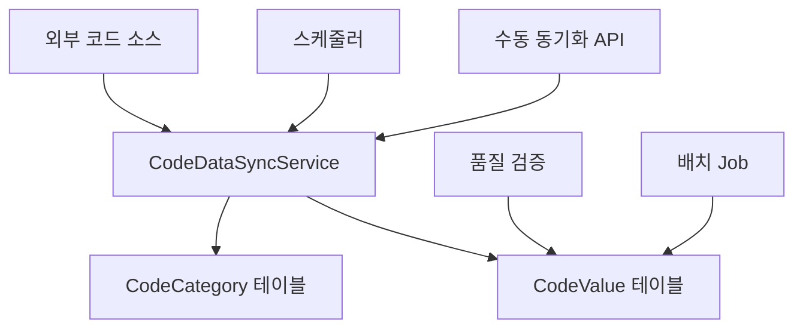

# 📊 코드 데이터 관리 및 자동 피딩 가이드

## 목차
1. [시스템 개요](#시스템-개요)
2. [자동 동기화 전략](#자동-동기화-전략)
3. [외부 API 연동](#외부-api-연동)
4. [수동 관리 방법](#수동-관리-방법)
5. [데이터 품질 관리](#데이터-품질-관리)
6. [모니터링 및 알림](#모니터링-및-알림)
7. [백업 및 복원](#백업-및-복원)

---

## 시스템 개요

### 🎯 **목적**
공공데이터 API 배치 작업에서 사용하는 **코드 파라미터들을 자동으로 최신 상태로 유지**하여 데이터 수집의 정확성과 완전성을 보장합니다.

### 🏗️ **아키텍처**


---

## 자동 동기화 전략

### 📅 **스케줄링 전략**

| 코드 카테고리 | 주기 | 시간 | 소스 API | 변경 빈도 |
|--------------|------|------|----------|-----------|
| **REGION** | 매일 | 01:30 | 행정표준코드관리시스템 | 중간 |
| **INDUSTRY** | 매일 | 01:45 | 통계청 KOSIS | 낮음 |
| **BUSINESS_TYPE** | 주간 | 일요일 02:00 | 정적 데이터 | 매우 낮음 |
| **VEHICLE_TYPE** | 월간 | 1일 02:00 | 교통안전공단 | 중간 |
| **품질 검증** | 매일 | 06:00 | 내부 검증 | - |

### 🔧 **자동 동기화 Job 설정**

#### 1. 지역코드 동기화 Job
```json
{
  "jobCode": "REGION_CODE_SYNC",
  "jobName": "지역코드 자동 동기화",
  "methodType": "API_GET",
  "resourceUrl": "https://www.code.go.kr/api/getCodeListAll.do",
  "parameters": {
    "codeId": "법정동코드",
    "format": "json"
  },
  "cronExpression": "0 30 1 * * ?",
  "status": "ACTIVE"
}
```

#### 2. 업종코드 동기화 Job
```json
{
  "jobCode": "INDUSTRY_CODE_SYNC",
  "jobName": "업종코드 자동 동기화", 
  "methodType": "API_GET",
  "resourceUrl": "https://kosis.kr/openapi/Param/statisticsParameterData.do",
  "parameters": {
    "method": "getList",
    "format": "json",
    "jsonVD": "Y",
    "userStatsId": "업종분류"
  },
  "cronExpression": "0 45 1 * * ?",
  "status": "ACTIVE"
}
```

---

## 외부 API 연동

### 🌐 **주요 외부 데이터 소스**

#### 1. 행정표준코드관리시스템 (지역코드)
- **API URL**: `https://www.code.go.kr/api/getCodeListAll.do`
- **인증**: API 키 필요
- **응답 형식**: JSON
- **업데이트 주기**: 불규칙 (행정구역 개편 시)

```bash
# API 호출 예시
curl -X GET "https://www.code.go.kr/api/getCodeListAll.do?codeId=법정동코드&format=json"
```

#### 2. 통계청 KOSIS API (업종코드)
- **API URL**: `https://kosis.kr/openapi/Param/statisticsParameterData.do`
- **인증**: API 키 필요
- **응답 형식**: JSON
- **업데이트 주기**: 연 1-2회

```bash
# API 호출 예시
curl -X GET "https://kosis.kr/openapi/Param/statisticsParameterData.do?method=getList&apiKey=YOUR_KEY&format=json"
```

#### 3. 교통안전공단 API (차량유형)
- **API URL**: `https://www.kotsa.or.kr/api/vehicle/types`
- **인증**: API 키 필요
- **응답 형식**: JSON
- **업데이트 주기**: 분기별

### 🔄 **동기화 프로세스**

```java
@Scheduled(cron = "0 30 1 * * ?")
public void syncRegionCodes() {
    // 1. 외부 API 호출
    String response = callExternalApi(apiUrl, params);
    
    // 2. 응답 데이터 파싱
    List<Map<String, Object>> regionData = parseApiResponse(response);
    
    // 3. 기존 데이터와 비교
    for (Map<String, Object> item : regionData) {
        String codeValue = (String) item.get("codeValue");
        String codeName = (String) item.get("codeName");
        
        // 4. 신규/변경 데이터 처리
        if (!codeExists(codeValue)) {
            createNewCode(codeValue, codeName, metadata);
        } else {
            updateCodeIfChanged(codeValue, codeName, metadata);
        }
    }
    
    // 5. 비활성화된 코드 처리
    deactivateObsoleteCodes(currentApiCodes);
}
```

---

## 수동 관리 방법

### 🛠️ **REST API 사용법**

#### 1. 전체 코드 동기화
```bash
POST /api/codes/sync/all
```

#### 2. 카테고리별 동기화
```bash
POST /api/codes/sync/category/REGION
POST /api/codes/sync/category/INDUSTRY
POST /api/codes/sync/category/BUSINESS_TYPE
```

#### 3. 동기화 상태 조회
```bash
GET /api/codes/sync/status
```

#### 4. 데이터 검증
```bash
GET /api/codes/sync/validate/REGION
```

### 🎛️ **프론트엔드 관리 도구**

#### CodeSync 페이지 주요 기능:
- **실시간 동기화 상태 모니터링**
- **카테고리별 수동 동기화 실행**
- **데이터 품질 검증 및 리포트**
- **백업 생성 및 관리**
- **동기화 스케줄 확인**

접속 경로: `http://localhost:3000/code-sync`

---

## 데이터 품질 관리

### 🔍 **품질 검증 항목**

#### 1. 데이터 무결성 검사
```java
public Map<String, Object> validateCodeData(String categoryCode) {
    return Map.of(
        "totalCount", codes.size(),
        "activeCount", activeCodeCount,
        "duplicateCount", duplicateCodeCount,
        "missingMetadataCount", missingMetadataCount,
        "lastUpdated", lastUpdateTime
    );
}
```

#### 2. 검증 기준
- **중복 코드 검사**: 동일 카테고리 내 중복 방지
- **메타데이터 검증**: 필수 메타데이터 누락 확인
- **형식 검증**: 코드 값 형식 규칙 준수
- **계층구조 검증**: 부모-자식 관계 무결성

### 📊 **품질 지표**

| 지표 | 목표값 | 경고값 | 위험값 |
|------|--------|--------|--------|
| 중복 코드 | 0개 | 1-2개 | 3개 이상 |
| 메타데이터 누락 | 0% | 1-5% | 5% 이상 |
| 활성 코드 비율 | 95% 이상 | 90-95% | 90% 미만 |
| 최종 업데이트 | 7일 이내 | 7-30일 | 30일 이상 |

---

## 모니터링 및 알림

### 📈 **모니터링 대시보드**

#### 주요 메트릭:
- **동기화 성공률**: 카테고리별 성공/실패 통계
- **API 응답시간**: 외부 API 성능 모니터링
- **데이터 변경량**: 일별 신규/변경/삭제 코드 수
- **품질 점수**: 종합 데이터 품질 지표

### 🚨 **알림 설정**

#### 1. 동기화 실패 알림
```yaml
alerts:
  sync_failure:
    condition: "동기화 실패 3회 이상"
    channels: ["email", "slack"]
    severity: "HIGH"
```

#### 2. 데이터 품질 저하 알림
```yaml
alerts:
  quality_degradation:
    condition: "중복 코드 3개 이상 OR 메타데이터 누락 5% 이상"
    channels: ["email"]
    severity: "MEDIUM"
```

---

## 백업 및 복원

### 💾 **백업 전략**

#### 1. 자동 백업
- **주기**: 매일 동기화 전
- **보관기간**: 30일
- **형식**: JSON 형태

#### 2. 수동 백업
```bash
POST /api/codes/sync/backup/REGION
```

#### 3. 백업 데이터 구조
```json
{
  "backupInfo": {
    "categoryCode": "REGION",
    "backupTime": "2024-01-15T02:00:00Z",
    "totalCount": 250
  },
  "codeData": [
    {
      "codeValue": "11110",
      "codeName": "서울특별시 종로구",
      "metadata": "{\"sido\":\"서울특별시\",\"gugun\":\"종로구\"}",
      "isActive": true,
      "sortOrder": 1
    }
  ]
}
```

### 🔄 **복원 절차**

#### 1. 긴급 복원 (API 장애 시)
```bash
# 1. 현재 데이터 백업
POST /api/codes/sync/backup/REGION

# 2. 이전 백업으로 복원
POST /api/codes/sync/restore/REGION
{
  "backupKey": "REGION_2024-01-14T02:00:00Z"
}
```

#### 2. 선택적 복원
- 특정 코드만 복원
- 특정 시점으로 롤백
- 메타데이터만 복원

---

## 실제 사용 시나리오

### 🏢 **시나리오 1: 행정구역 개편 대응**

**상황**: 새로운 행정구역 신설/통합
```bash
# 1. 긴급 수동 동기화
POST /api/codes/sync/category/REGION

# 2. 영향받는 Job 확인
GET /api/jobs?parameterType=MATRIX&parameter=LAWD_CD

# 3. 테스트 실행
POST /api/jobs/test/REAL_ESTATE_APARTMENT_TRADE

# 4. 데이터 검증
GET /api/codes/sync/validate/REGION
```

### 📊 **시나리오 2: 업종분류 개정 대응**

**상황**: 한국표준산업분류 개정
```bash
# 1. 백업 생성
POST /api/codes/sync/backup/INDUSTRY

# 2. 새로운 분류 동기화
POST /api/codes/sync/category/INDUSTRY

# 3. 매핑 테이블 업데이트 (필요시)
POST /api/codes/mapping/INDUSTRY/update

# 4. 기존 Job 파라미터 검증
GET /api/job-parameter-configs?valueSource=CODE_CATEGORY:INDUSTRY
```

### 🚨 **시나리오 3: API 장애 대응**

**상황**: 외부 API 서비스 중단
```bash
# 1. 장애 감지 및 알림
GET /api/codes/sync/health-check

# 2. 최신 백업으로 임시 운영
POST /api/codes/sync/restore/latest

# 3. 수동 코드 업데이트
POST /api/codes/REGION/values
{
  "codeValue": "11000",
  "codeName": "서울특별시 신규구",
  "metadata": "{\"sido\":\"서울특별시\",\"level\":\"구\"}"
}

# 4. API 복구 후 재동기화
POST /api/codes/sync/force-update
```

---

## 최적화 및 성능 튜닝

### ⚡ **성능 최적화**

#### 1. 캐싱 전략
```java
@Cacheable(value = "codes", key = "#categoryCode")
public List<String> getCodeValuesByCategory(String categoryCode) {
    return codeValueRepository.findCodeValuesByCategoryCode(categoryCode);
}
```

#### 2. 배치 처리
- 대량 업데이트 시 배치 Insert/Update 사용
- 트랜잭션 크기 최적화 (1000개 단위)

#### 3. 비동기 처리
```java
@Async
public CompletableFuture<String> syncRegionCodes() {
    // 비동기 동기화 처리
}
```

### 📊 **모니터링 지표**

| 지표 | 정상 범위 | 주의 범위 | 위험 범위 |
|------|-----------|-----------|-----------|
| 동기화 시간 | < 30초 | 30초-1분 | > 1분 |
| API 응답시간 | < 3초 | 3-10초 | > 10초 |
| 메모리 사용량 | < 70% | 70-85% | > 85% |
| 에러율 | < 1% | 1-5% | > 5% |

---

## 트러블슈팅

### 🔧 **일반적인 문제 해결**

#### 1. 동기화 실패
```bash
# 로그 확인
tail -f logs/dsflow.log | grep "CODE_SYNC"

# 수동 재시도
POST /api/codes/sync/category/REGION

# API 상태 확인
GET /api/codes/sync/external-api-status
```

#### 2. 중복 코드 발생
```bash
# 중복 코드 조회
GET /api/codes/sync/validate/REGION

# 중복 제거
POST /api/codes/sync/deduplicate/REGION
```

#### 3. 메타데이터 손실
```bash
# 백업에서 메타데이터 복원
POST /api/codes/sync/restore-metadata/REGION
{
  "backupKey": "REGION_2024-01-14T02:00:00Z",
  "metadataOnly": true
}
```

---

## 결론

이 **코드 데이터 관리 시스템**을 통해:

✅ **자동화된 코드 데이터 수집 및 업데이트**  
✅ **실시간 품질 모니터링 및 검증**  
✅ **안전한 백업 및 복원 체계**  
✅ **유연한 수동 관리 도구**  
✅ **확장 가능한 외부 API 연동**

**공공데이터 API 배치 작업의 파라미터들이 항상 최신 상태로 유지**되어, 안정적이고 정확한 데이터 수집이 가능합니다! 🚀 